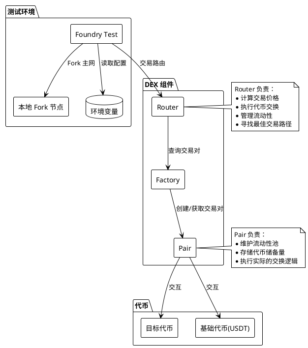
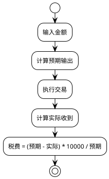
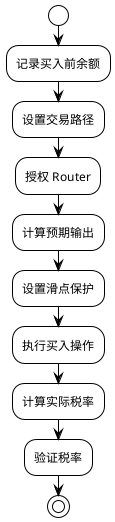

# Foundry Fork 模拟测试方案

## 概述
本文档详细说明如何使用 Foundry 的 fork 功能进行合约手续费分析。通过 fork 主网状态，我们可以在本地环境中精确模拟和分析合约的交易行为。

### 测试内容
- 买入手续费计算与验证
- 卖出手续费计算与验证
- 转账手续费计算与验证
- 滑点保护机制验证
- 交易事件分析

### 系统架构图

## 环境配置
### 1. 项目初始化
```bash
# 创建新项目
forge init contract-fork-analyzer
cd contract-fork-analyzer

# 安装依赖（使用 --no-commit 选项避免 git 问题）
forge install --no-commit OpenZeppelin/openzeppelin-contracts
forge install --no-commit Uniswap/v2-core
forge install --no-commit Uniswap/v2-periphery
forge install --no-commit Uniswap/v3-core
forge install --no-commit Uniswap/v3-periphery
forge install --no-commit pancakeswap/pancake-smart-contracts

# 注意：如果遇到 git 相关错误，可以尝试：
# 1. 使用 --no-commit 选项
# 2. 先初始化 git 仓库
# 3. 确保工作目录干净
```

## 核心概念解析

### 1. DEX 组件
- **Router（路由器）**：
  - 作为交易所的"交易员"
  - 负责计算交易价格
  - 执行代币交换
  - 管理流动性
  - 寻找最佳交易路径

- **Factory（工厂）**：
  - 负责创建和管理交易对
  - 维护交易对注册表
  - 提供交易对查询功能

- **Pair（交易对）**：
  - 维护两个代币的流动性池
  - 存储代币储备量
  - 执行实际的交换逻辑

### 2. 滑点保护机制
```solidity
// 设置滑点示例
uint256 slippage = 100; // 1% = 100 基点
uint256 amountOutMin = expectedOut * (10000 - slippage) / 10000;
```
- 作用：防止价格大幅波动导致的损失
- 计算方式：基于基点（1 基点 = 0.01%）
- 实现：通过 `amountOutMin` 参数设置最小收到数量
- 触发：如果实际收到数量小于 `amountOutMin`，交易会被回滚

### 3. 税费计算


税费计算公式：
- 买入税：`(expectedOut - actualReceived) * 10000 / expectedOut`
- 卖出税：`(totalTax * 10000) / tokenAmount`
- 转账税：`(amount - recipientBalance) * 10000 / amount`

### 4. MEV 与滑点保护深入分析

#### 4.1 交易执行机制
```solidity
// Router 的交易执行函数
function swapExactTokensForTokens(
    uint amountIn,          // 输入金额
    uint amountOutMin,      // 最小输出金额（滑点保护）
    address[] path,         // 交易路径
    address to,             // 接收地址
    uint deadline           // 截止时间
) returns (uint[] amounts)
```

#### 4.2 滑点保护详解
1. **基本概念**：
   - 滑点 = (预期价格 - 实际价格) / 预期价格 * 100%
   - `amountOutMin` = 预期输出 * (1 - 最大允许滑点)

2. **保护机制**：
   ```solidity
   // 示例：设置 1% 滑点保护
   uint256 expectedOut = router.getAmountsOut(amountIn, path)[1];
   uint256 amountOutMin = expectedOut * 99 / 100;  // 允许 1% 滑点
   ```

#### 4.3 MEV 影响分析

1. **MEV 基本原理**：
   - 在同一区块内，交易按 gas price 排序
   - 高 gas price 的交易优先执行
   - MEV 机器人通过高 gas price 抢先执行获利

2. **常见 MEV 策略**：
   ```
   用户交易：买入 1 USDT 代币
   ↓
   MEV 机器人：
   1. 发现用户交易
   2. 提交更高 gas price 的交易
   3. 先于用户买入，抬高价格
   4. 用户交易执行，承受更高价格
   5. 机器人卖出获利
   ```

3. **MEV 防护措施**：
   - 设置合理的滑点保护
   - 使用 MEV 保护交易（如 Flashbots）
   - 避免大额交易或分批执行
   - 选择支持 MEV 保护的 DEX

4. **税费对 MEV 的影响**：
   ```
   假设：
   - 买入税：3%
   - 卖出税：5%
   - DEX 手续费：0.25%
   
   MEV 最小获利要求：
   总成本 = 买入成本 + 卖出成本
         = (3% + 0.25%) + (5% + 0.25%)
         = 8.5%
   
   因此需要价格差大于 8.5% 才可能获利
   ```

5. **不同链的 MEV 特点对比**：

   a) **Ethereum MEV**：
   ```
   区块时间：约 12 秒
   验证者选择机制：
   - 使用 RANDAO 机制进行随机选择
   - 每个 slot (12秒) 随机选择提议者
   - 基于多个验证者提供的随机数
   
   代码示例：
   ```solidity
   contract RANDAO {
       bytes32 public mix;
       
       // 每个验证者提供随机数
       function reveal(bytes32 commitment) public {
           // 混合多个验证者的随机性
           mix = keccak256(abi.encodePacked(mix, commitment));
       }
   }
   ```
   
   MEV 实现机制：
   - 基于 gas price 的交易排序
   - mempool 监控和前置交易
   - 使用 Flashbots 等 MEV 保护
   
   优势：
   - 有足够时间进行 MEV 操作
   - 生态系统成熟
   - 工具链完善
   ```

   b) **Solana MEV**：
   ```
   区块时间：约 400ms
   验证者选择机制：
   - Leader Schedule 确定性选择
   - 提前知道未来的验证者
   - 基于质押权重计算
   
   代码示例：
   ```rust
   struct LeaderSchedule {
       // 每个 epoch (约2天) 更新一次
       epoch: u64,
       // 基于质押权重的验证者排序
       schedule: Vec<(Slot, Pubkey)>,
       // 验证者权重
       stake_weights: HashMap<Pubkey, u64>
   }
   ```
   
   MEV 实现机制：
   - 验证者直接合作
   - 使用专门的 MEV 基础设施（如 Jito Labs）
   - 并行提交多个交易版本
   
   特点：
   - 需要更专业的基础设施
   - 对延迟要求更高
   - 通常需要与验证者直接合作
   ```

   c) **机制对比分析**：
   ```
   Ethereum RANDAO:
   - 优点：更好的随机性和不可预测性
   - 缺点：需要额外的共识回合
   - 安全性：较高，难以操纵
   
   Solana Leader Schedule:
   - 优点：更快的确认速度，更高的吞吐量
   - 缺点：验证者可被提前知道
   - 补偿措施：高质押要求和严格的惩罚机制
   
   对 MEV 的影响：
   - Ethereum: MEV 机会更公平，但竞争更激烈
   - Solana: MEV 需要更多与验证者合作，门槛更高
   ```

#### 4.4 测试要点

1. **滑点测试**：
   ```solidity
   function testSlippage() public {
       // 设置不同级别的滑点保护
       uint256[] memory slippages = [10, 50, 100, 500]; // 0.1%, 0.5%, 1%, 5%
       
       for (uint i = 0; i < slippages.length; i++) {
           uint256 amountOutMin = expectedOut * (10000 - slippages[i]) / 10000;
           // 测试交易是否在滑点范围内执行
       }
   }
   ```

2. **MEV 模拟测试**：
   ```solidity
   function testMEV() public {
       // 测试不同价格变动场景
       uint256[] memory priceChanges = [
           500,   // 5%
           850,   // 8.5% (接近盈亏平衡点)
           1000,  // 10%
           1500   // 15%
       ];
       
       for (uint i = 0; i < priceChanges.length; i++) {
           calculateReturn(inputAmount, priceChanges[i]);
       }
   }

   function calculateReturn(uint256 investment, uint256 priceChangeInBps) internal {
       // priceChangeInBps 是以基点(1/10000)为单位
       // 例如：850 表示 8.5%
       console.log("\nWith %s%% price increase:", priceChangeInBps / 100);
       
       // 计算收益
       // ... rest of the calculation ...
   }
   ```

3. **关键验证点**：
   - 滑点保护是否有效触发
   - 税费是否正确计算
   - MEV 操作的影响程度
   - 各种保护机制的有效性

## 测试流程详解

### 1. 编译优化
#### via-IR 优化
```solidity
// 使用 --via-ir 参数进行优化编译
forge test -vvv --match-test testMevAttack --via-ir
```

**为什么需要 via-IR：**
1. **解决栈深度问题**
   - EVM 栈限制为 16 个槽位
   - 复杂测试函数可能导致 "Stack too deep" 错误
   - via-IR 优化器能更智能地管理栈空间

2. **优化效果**
   - 生成更紧凑的字节码
   - 降低 gas 消耗
   - 优化变量生命周期
   - 自动进行变量打包

3. **使用建议**
   - 开发阶段：可以不使用 --via-ir（编译更快）
   - 遇到栈溢出：添加 --via-ir 参数
   - 生产部署：建议使用 --via-ir 进行最终优化

### 2. 环境设置 (setUp)
```solidity
// 代码片段展示关键步骤
vm.createSelectFork("http://localhost:8545");
config = new TestConfig();
uint256 chainId = vm.envUint("CHAIN_ID");
string memory dexName = vm.envString("DEX_NAME");
```

关键步骤：
1. 创建本地 fork 节点
2. 初始化配置
3. 设置链接口
4. 准备测试账户

### 3. 买入测试 (testBuyTax)


关键知识点：
1. **授权机制**：
   ```solidity
   IERC20Metadata(baseToken).approve(address(router), type(uint256).max);
   ```
   - 为什么需要：代币转移需要持有者授权
   - 授权对象：Router 合约
   - 授权金额：最大值（实际项目中需谨慎）

2. **交易路径**：
   ```solidity
   address[] memory path = new address[](2);
   path[0] = baseToken;        // 起始代币（USDT）
   path[1] = address(token);   // 目标代币
   ```
   - 定义代币兑换路径
   - 可以包含多个中间代币

3. **预期计算**：
   ```solidity
   uint256[] memory amounts = router.getAmountsOut(amountIn, path);
   ```
   - 通过 Router 计算预期输出
   - 考虑流动性池状态
   - 基于恒定乘积公式

### 4. 卖出测试 (testSellTax)
特点：
- 需要先获取代币（通过买入）
- 使用事件分析计算税率
- 分析转账事件确定实际税费

### 5. 转账测试 (testTransferTax)
特点：
- 直接转账操作
- 简单的税率计算
- 支持无税情况判断

## 最佳实践

1. **滑点保护**：
   - 始终设置合理的滑点保护
   - 根据市场波动情况调整滑点比例
   - 避免设置为 0（无保护）

2. **授权安全**：
   - 在测试环境可以使用最大值授权
   - 生产环境应该精确授权所需金额
   - 及时清除不需要的授权

3. **事件分析**：
   - 使用事件分析追踪资金流向
   - 验证税费计算的准确性
   - 分析异常交易行为

4. **错误处理**：
   - 使用 try-catch 捕获异常
   - 提供清晰的错误信息
   - 合理的错误恢复机制

## 注意事项
1. 确保本地 fork 节点正常运行
2. 验证交易对存在且有足够流动性
3. 注意代币精度差异
4. 考虑网络特定配置（如 BSC 的 gas 设置）

## 更新记录
- 2024-03-21：更新为命令行执行格式
- 2024-03-21：添加进度追踪
- 2024-03-21：优化配置文件设置步骤
- 2024-03-21：更新测试合约结构
- 2024-03-22：添加详细的代码分析和知识点
- 2024-03-22：添加 PlantUML 流程图
- 2024-03-22：补充滑点保护机制说明
  